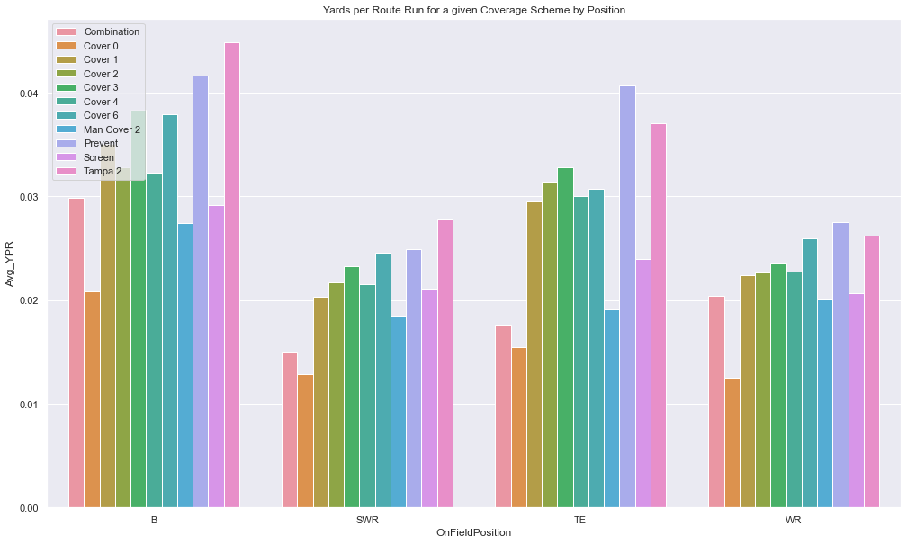

Sports Info Solutions analytics challenge: https://github.com/ecavan/AnalyticsChallenge2021

Q: Which route combinations were most popular in the NFL in 2020? Of these route combinations, which perform best against each coverage type?

# Imports & Data


```python
from IPython.core.display import display, HTML
import pandas as pd
display(HTML("<style>.container { width:100% !important; }</style>"))

desired_width = 320    
pd.set_option('display.width', desired_width)
```


<style>.container { width:100% !important; }</style>


```python
import numpy as np
import scipy.stats as stats
import copy

%matplotlib inline
import matplotlib.pyplot as plt
import seaborn as sns; sns.set() 
from collections import Counter

import category_encoders as ce

from sklearn.cluster import KMeans
from sklearn.preprocessing import MinMaxScaler
from sklearn.model_selection import train_test_split
from sklearn.model_selection import cross_validate
from sklearn import preprocessing
from sklearn.impute import SimpleImputer
from sklearn.preprocessing import OrdinalEncoder
from sklearn.preprocessing import StandardScaler
from sklearn.linear_model import LogisticRegression
from sklearn.ensemble import RandomForestClassifier, RandomForestRegressor
from sklearn.tree import DecisionTreeClassifier
from sklearn.metrics import accuracy_score, f1_score, confusion_matrix, balanced_accuracy_score, mean_absolute_error
from sklearn.utils import resample

import warnings
warnings.filterwarnings('ignore')

plays = pd.read_csv('PlayByPlay.csv')
games = pd.read_csv('GameInfo.csv')
games = games.drop(['Week', 'Season'], axis=1)
points = pd.read_csv('PlayerTotalPoints.csv')
points=points.rename(columns = {'Name':'Name_points'})
skillpos = pd.read_csv('SkillPositionPlayers.csv')
tms = pd.read_csv('tms.csv')
rates = pd.read_csv('M21 Launch Ratings - Sheet1.csv')
rates = rates[['Name', 'archetype', 'overall_rating']]

print(rates.columns)
print(len(rates))
print(plays.columns)
print(len(plays))
print(' ')
print(games.columns)
print(len(games))
print(' ')
print(points.columns)
print(len(points))
print(' ')
print(skillpos.columns)
print(len(skillpos))
print(' ')
### from: https://www.pro-football-reference.com/years/2020/index.htm ###

print(tms.columns)
```

    Index(['Name', 'archetype', 'overall_rating'], dtype='object')
    2293
    Index(['GameID', 'EventID', 'Season', 'Week', 'OffensiveTeam', 'DefensiveTeam', 'OffTeamScoreBefore', 'DefTeamScoreBefore', 'Quarter', 'TimeLeft', 'Down', 'ToGo', 'SideOfField', 'StartYard', 'Hash', 'EventType', 'FirstDown', 'Touchdown', 'Safety', 'Turnover', 'Attempt', 'Completion', 'Spike', 'ThrowAway',
           'ThrowDepth', 'Shotgun', 'DropType', 'RPO', 'CoverageScheme', 'PressureOnPlay', 'SackOnPlay', 'PassBreakupOnPlay', 'InterceptionOnPlay', 'FumbleByPasser', 'FumbleByRusher', 'FumbleByReceiver', 'OffensiveYardage', 'EPA', 'PlayDesc'],
          dtype='object')
    32170
     
    Index(['GameId', 'HomeTeamId', 'HomeTeam', 'AwayTeamId', 'AwayTeam', 'StadiumName', 'CoveredStadium', 'HomeScore', 'AwayScore', 'SpreadLine', 'TotalLine', 'SpreadResult', 'TotalResult', 'Weather', 'PrecipIntensity', 'PrecipProbability', 'PrecipType', 'Temperature', 'WindSpeed'], dtype='object')
    256
     
    Index(['GameID', 'PlayerId', 'Name_points', 'TotalPoints'], dtype='object')
    20292
     
    Index(['GameID', 'EventID', 'PlayerId', 'Name', 'RosterPosition', 'OnFieldPosition', 'SideOfCenter', 'Order_OutsideToInside', 'IsBlocking', 'Route', 'FastMotion', 'Target', 'Reception'], dtype='object')
    192988
     
    Index(['Tm', 'W', 'L', 'T', 'W-L%', 'PF', 'PA', 'PD', 'MoV', 'SoS', 'SRS', 'OSRS', 'DSRS'], dtype='object')


```python
plays_games = plays.merge(games, left_on = 'GameID', right_on = 'GameId')
plays_games_points = plays_games.merge(points, on = 'GameID')
full_df = plays_games_points.merge(skillpos, on = ['GameID', 'PlayerId', 'EventID'])
full_df = full_df.merge(tms, left_on = 'OffensiveTeam', right_on = 'Tm')
full_df = full_df.merge(rates, on ='Name', how = 'left')
```

# Feature Engineering & Data Cleaning


```python
full_df["Route"].replace({"Screen - Shovel": "Screen", 
                          "Screen - TE": "Screen",
                          "Screen - Drag":"Screen",
                          "Screen - Beneath":"Screen",
                          "Screen - Tunnel": "Screen",
                          "Screen - Quick":"Screen",
                          "Screen - Bubble":"Screen",
                          "Screen - RB":"Screen",
                          "Flat - Left":"Flat",
                          "Chip - Flat":"Flat",
                          "Flat - Right":"Flat",
                          "Stick - Nod":"Flat",
                          "Chip - Drag":"Drag",
                          "Chip - Seam":"Seam",
                          "Chip - Curl":"Curl",
                          "Swing - Left":"Swing",
                          "Swing - Right":"Swing",
                          "Go/Fly":"Go",
                          "Hitch & Go": "Go",
                          "Out & Up": "Sluggo",
                          'Comeback':"Curl",
                          'Whip':"Flat",
                          "Dig":"Flat",
                          'Jerk':"Curl",
                          "Post Corner":"Post",
                          'Beneath':"Quick",
                          "Check & Release":"Go",
                          "Drag": 'Flat',
                          "Angle": "Slant",
                          "Leak": "Flat",
                          "Seam":"Go",
                          "Fade - Back Shoulder":"Fade"}, inplace=True)


full_df = full_df[(full_df.CoverageScheme != "Spike") & (full_df.CoverageScheme != "Other")]
```


```python
full_df.loc[full_df['Target'] == 1, 'air_yards'] = full_df['ThrowDepth']

full_df['AYPA'] = full_df['air_yards']/full_df['Attempt']
full_df['YPA'] = full_df['OffensiveYardage']/full_df['Attempt']

full_df.loc[(full_df['SideOfField'] == 'Own')&(full_df['StartYard'] < 20), 'FieldPosition'] = 'EZ'
full_df.loc[(full_df['SideOfField'] == 'Oppo')&(full_df['StartYard'] < 20), 'FieldPosition'] = 'RZ'
full_df.loc[(full_df['StartYard'] > 20), 'FieldPosition'] = 'Mid'

full_df_target = full_df[full_df.Target ==  1]
full_df_target = full_df_target[full_df_target.groupby('Route')['Route'].transform('size') > 39]

gb_routes = full_df_target.groupby('Route', dropna=False)['air_yards'].mean().reset_index()
kmeans = KMeans(n_clusters=3)
kmeans.fit(gb_routes['air_yards'].values.reshape(-1,1))
y_kmeans = kmeans.predict(gb_routes['air_yards'].values.reshape(-1,1))

long = gb_routes[gb_routes.air_yards > 20]['Route'].to_list()
medium = gb_routes[(gb_routes.air_yards < 20) & (gb_routes.air_yards >= 10)]['Route'].to_list()
short = gb_routes[(gb_routes.air_yards < 10) & (gb_routes.air_yards >= -0.5)]['Route'].to_list()
screen = gb_routes[gb_routes.air_yards < -0.5]['Route'].to_list()
rpo = full_df[(full_df.RPO == 1)&(full_df.Target == 1)].index.to_list()

full_df.loc[full_df['Route'].isin(long), 'route_len'] = 'Long'
full_df.loc[full_df['Route'].isin(medium), 'route_len'] = 'Medium'
full_df.loc[full_df['Route'].isin(short), 'route_len'] = 'Short'
full_df.loc[full_df['Route'].isin(screen), 'route_len'] = 'Screen'
full_df.loc[full_df.index.isin(rpo), 'Route'] = 'rpo'

rpo_list = full_df[full_df.Route == 'rpo']['Route'].to_list()
```

Kmeans plot of all routes clustered into classes: long, medium, short and screen routes (this is done to easily distinguish between the variety of routes available). I will use the classes of routes for key calculations and then refer to the routes that are best in their given class (i.e the best short routes, the best medium routes, ect) to make predictions using the machine learning models (Expected points, probability of a first down). 

Note: I used 3 clusters, but took any routes with air yards < -0.5 to be considered screens.


```python
plt.rcParams["figure.figsize"] = (17,10)
plt.scatter(gb_routes['Route'], gb_routes['air_yards'], c=y_kmeans, s=50, cmap='viridis')
plt.xticks([]);

for i, txt in enumerate(gb_routes['Route']):
    plt.annotate(txt, (gb_routes['Route'][i], gb_routes['air_yards'][i]))   
```


```python
full_df_catch = full_df[full_df.Completion == 1]
full_df['YAC'] = full_df_catch.OffensiveYardage - full_df_catch.ThrowDepth

full_df['YAC_per_cov'] = full_df.groupby('CoverageScheme', dropna=False)['YAC'].transform('mean')

pressure_df = (full_df.groupby(['CoverageScheme', 'DefensiveTeam'])['PressureOnPlay'].sum()/full_df.groupby('DefensiveTeam')['CoverageScheme'].size()).reset_index(name = 'pressure_rate_per_coverage')
breakup_df = ((full_df.groupby(['CoverageScheme', 'DefensiveTeam'])['PassBreakupOnPlay'].sum() + full_df.groupby(['CoverageScheme', 'DefensiveTeam'])['ThrowAway'].sum() )/full_df.groupby('DefensiveTeam')['CoverageScheme'].size()).reset_index(name = 'breakup_rate_per_coverage')
target_df = (full_df.groupby(['CoverageScheme', 'DefensiveTeam'])['Target'].sum()/full_df.groupby('DefensiveTeam')['CoverageScheme'].size()).reset_index(name = 'target_rate_per_coverage')
fd_df = (full_df.groupby(['CoverageScheme', 'DefensiveTeam'])['FirstDown'].sum()/full_df.groupby('DefensiveTeam')['CoverageScheme'].size()).reset_index(name = 'firstdown_rate_per_coverage')

fm_df = (full_df.groupby(['OffensiveTeam'])['FastMotion'].sum()/full_df.groupby('OffensiveTeam')['CoverageScheme'].size()).reset_index(name = 'motion_rate_per_coverage')

full_df = full_df.merge(breakup_df, on = ['CoverageScheme', 'DefensiveTeam'])
full_df = full_df.merge(pressure_df, on = ['CoverageScheme', 'DefensiveTeam'])
full_df = full_df.merge(target_df, on = ['CoverageScheme', 'DefensiveTeam'])
full_df = full_df.merge(fd_df, on = ['CoverageScheme', 'DefensiveTeam'])
full_df = full_df.merge(fm_df, on = 'OffensiveTeam')
```

Obviously having a greater QB throwing the ball or having a better receiver on the end of that throw matters. I used the Total_Points feature from SIS to create a meature which determines how much better a player like Tom Brady is compared to the average QB (Points above Average, instead of Points above replacement, since I had no idea how a replacement level QB should preform). I didn't include players with less than 300 snaps so that they would not influence the calculation of the mean. 


```python
snaps = full_df.groupby(['RosterPosition', 'Name'])['Name'].size().reset_index(name = 'snaps')
full_df = full_df.merge(snaps, on =['RosterPosition', 'Name'])
full_df = full_df[full_df.snaps > 50]

full_df['Average_points'] = full_df.groupby('RosterPosition')['TotalPoints'].transform('mean')
full_df['PAA'] = (full_df.groupby('Name')['TotalPoints'].transform('mean') - full_df['Average_points'])/full_df['Average_points']

```


```python
full_df['Yards_per_route'] = full_df['OffensiveYardage']/full_df['snaps']
full_df_noqb = full_df[full_df.OnFieldPosition != 'QB']
gb = (full_df_noqb.groupby(['OnFieldPosition', "CoverageScheme" ])['air_yards'].sum()/full_df_noqb.groupby(['OnFieldPosition', "CoverageScheme" ])['Attempt'].sum()).reset_index(name = 'APA')

gb_ybr = full_df_noqb.groupby(['OnFieldPosition', "CoverageScheme" ])['Yards_per_route'].mean().reset_index(name = 'Avg_YPR')

sns.barplot(x='OnFieldPosition', y='Avg_YPR', hue="CoverageScheme", data=gb_ybr);
plt.title('Yards per Route Run for a given Coverage Scheme by Position');
plt.legend(loc='upper left');
```





```python
sns.barplot(x='OnFieldPosition', y='APA', hue = "CoverageScheme", data=gb);
plt.title('Air Yards per Attempt by Position & Coverage Scheme');
```


```python
###sample players###
full_df_wr = full_df[(full_df.RosterPosition == 'WR')&(full_df.snaps > 250)]
full_df_qb = full_df[(full_df.RosterPosition == 'QB')&(full_df.snaps > 250)]

madden_df = pd.DataFrame(full_df.sort_values('overall_rating', ascending = False))
madden_df = madden_df[['Name', 'RosterPosition','overall_rating']]
madden_df.drop_duplicates(keep = 'first', inplace=True)

print('Sample of High Preforming QBs')
print(' ')
print(full_df_qb[full_df_qb.PAA > 0]['Name'].unique())
print(' ')
madden_df_qb = madden_df[madden_df.RosterPosition == 'QB']
print('Top QBs in Madden')
print(' ')
print(madden_df_qb[0:5])

plt.hist(full_df_qb['PAA']);
plt.title('Histogram of PAA for QBs')
plt.show()

print('Sample of High Preforming WRs')
print(' ')
print(full_df_wr[full_df_wr.PAA > 1]['Name'].unique())
print( ' ')
madden_df_wr = madden_df[madden_df.RosterPosition == 'WR']
print('Top WRs in Madden')
print(' ')
print(madden_df_wr[0:5])

plt.hist(full_df_wr['PAA']);
plt.title('Histogram of PAA for WRs')
plt.show()
```

    Sample of High Preforming QBs
     
    ['Deshaun Watson' 'Matt Ryan' 'Josh Allen' 'Derek Carr'
     'Teddy Bridgewater' 'Justin Herbert' 'Drew Brees' 'Tom Brady'
     'Patrick Mahomes' 'Philip Rivers' 'Joe Burrow' 'Ryan Tannehill'
     'Russell Wilson' 'Matthew Stafford' 'Aaron Rodgers' 'Kirk Cousins'
     'Kyler Murray']
     
    Top QBs in Madden
     
                      Name RosterPosition  overall_rating
    47988  Patrick Mahomes             QB            99.0
    88905   Russell Wilson             QB            97.0
    8196     Lamar Jackson             QB            94.0
    37265       Drew Brees             QB            93.0
    41624        Tom Brady             QB            90.0


    Sample of High Preforming WRs
     
    ['Calvin Ridley' 'Julio Jones' 'Stefon Diggs' 'Cole Beasley'
     'Keenan Allen' 'Michael Thomas' 'Tyreek Hill' 'Jarvis Landry'
     'Corey Davis' 'Davante Adams' 'Justin Jefferson' 'Brandon Aiyuk'
     'DeAndre Hopkins' 'Cooper Kupp']
     
    Top WRs in Madden
     
                       Name RosterPosition  overall_rating
    39669    Michael Thomas             WR            99.0
    110383  DeAndre Hopkins             WR            98.0
    7592        Julio Jones             WR            97.0
    48868       Tyreek Hill             WR            96.0
    101045    Davante Adams             WR            94.0


Next, I wanted to classify players based on their specialities with the routes they run. i.e a player like Tyreek Hill would have a speciality as a player who is exceptional at running 'Long' routes like Streaks and Corner Post routes. The best receivers (like Tyreek Hill) may be classified as a specialist with multipe route types. The idea is if you are a specialist as a short route receiver, you are worth more running a short route compared to a long route.


```python
player_type = full_df.groupby(['Name', 'route_len'])['EPA'].agg(['mean', 'count']).reset_index()

mean_len_long = np.mean(player_type[player_type.route_len == 'Long']['count'])
mean_len_med = np.mean(player_type[player_type.route_len == 'Medium']['count'])
mean_len_short = np.mean(player_type[player_type.route_len == 'Short']['count'])
mean_len_screen = np.mean(player_type[player_type.route_len == 'Screen']['count'])

mean_epa_long = np.mean(player_type[player_type.route_len == 'Long']['mean'])
mean_epa_med = np.mean(player_type[player_type.route_len == 'Medium']['mean'])
mean_epa_short = np.mean(player_type[player_type.route_len == 'Short']['mean'])
mean_epa_screen = np.mean(player_type[player_type.route_len == 'Screen']['mean'])

player_type['Classify'] = np.nan

player_type.loc[(player_type.route_len == 'Long')&(player_type['mean'] >= 1.5*mean_epa_long)&(player_type['count'] >= 1.2*mean_len_long), 'Classify'] = 'Long'
player_type.loc[(player_type.route_len == 'Short')&(player_type['mean'] >= 1.5*mean_epa_short)&(player_type['count'] >= 1.2*mean_len_short), 'Classify'] = 'Short'
player_type.loc[(player_type.route_len == 'Medium')&(player_type['mean'] >= 1.5*mean_epa_med)&(player_type['count'] >= 1.2*mean_len_med), 'Classify'] = 'Medium'
player_type.loc[(player_type.route_len == 'Screen')&(player_type['mean'] >= 1.5*mean_epa_screen)&(player_type['count'] >= 1.2*mean_len_screen), 'Classify'] = 'Screen'

player_type = player_type.dropna()
gb = player_type.groupby('Name')['Classify'].unique().reset_index(name = 'receiver_class')

full_df = full_df.merge(gb, on = 'Name', how = 'left')
full_df['receiver_class'] = full_df['receiver_class'].fillna('None')

##A bool which determines if a player (or multiple players) are running a specialized route on the play##
full_df['Running_specialized_route'] = full_df.apply(lambda x: str(x['route_len']) in x['receiver_class'], axis=1)

```

Are slot receivers better than wideouts for certain schemes?


```python
gb_pos = full_df_noqb.groupby(['CoverageScheme','OnFieldPosition' ])['EPA'].mean().reset_index(name = 'Avg_EPA')

sns.barplot(x="CoverageScheme", y='Avg_EPA', hue='OnFieldPosition', data=gb_pos);
plt.title('EPA for Different Receiver Positions for a given Coverage Scheme');
```


# Most Popular Route Combinations

The first part of the question asks what are the most popular route combinations, we answer this questiom in the following cells.

First: Get Personnel Groupings


```python
pos_df = full_df.groupby(['GameID', 'EventID'])['OnFieldPosition'].apply(list).reset_index()
pos_df.columns = ['GameID', 'EventID', 'position']

full_df = full_df.merge(pos_df, on =['GameID', 'EventID'])
full_df['position'] = full_df['position'].sort_values().apply(lambda x: sorted(x))

full_df['QB_in_play'] = full_df.apply(lambda x: "QB" in x['position'], axis=1)

full_df = full_df[full_df['QB_in_play']]

full_df['num_B'] = full_df.apply(lambda x: x['position'].count("B"), axis=1)
full_df['num_TE'] = full_df.apply(lambda x: x['position'].count("TE"), axis=1)

full_df.loc[(full_df.num_TE == 2) & (full_df.num_B == 1), 'personnel'] = "12"
full_df.loc[(full_df.num_TE == 2) & (full_df.num_B == 0), 'personnel'] = '2'
full_df.loc[(full_df.num_TE == 1) & (full_df.num_B == 2), 'personnel'] = '21'
full_df.loc[(full_df.num_TE == 2) & (full_df.num_B == 2), 'personnel'] = '22'
full_df.loc[(full_df.num_TE == 1) & (full_df.num_B == 1), 'personnel'] = '11'
full_df.loc[(full_df.num_TE == 0) & (full_df.num_B == 1), 'personnel'] = '10'
full_df.loc[(full_df.num_TE == 3) & (full_df.num_B == 2), 'personnel'] = '23'
full_df.loc[(full_df.num_TE == 0) & (full_df.num_B == 0), 'personnel'] = '0'
full_df.loc[(full_df.num_TE == 1) & (full_df.num_B == 0), 'personnel'] = '1'
full_df.loc[(full_df.num_TE == 3) & (full_df.num_B == 1), 'personnel'] = '13'
full_df.loc[(full_df.num_TE == 0) & (full_df.num_B == 2), 'personnel'] = '12'

###10 personnel is the most common formation####

full_df.personnel.value_counts()
```


    10    35399
    11    32956
    12    15504
    0     12992
    1      4806
    21     3078
    13     2774
    2      1298
    22      485
    23       43
    Name: personnel, dtype: int64


```python
gb_p = full_df.groupby(['personnel', "CoverageScheme"])['EPA'].mean().reset_index(name = 'avg_epa')

sns.barplot(x="personnel", y='avg_epa', hue='CoverageScheme', data=gb_p);
plt.title('EPA by Personnel against a given Coverage Scheme');
```


```python
full_df['Route'] = full_df['Route'].fillna('Blocking')

full_df_with_block = full_df.copy()
full_df = full_df[full_df['Route'] != 'Blocking']

route_df = full_df.groupby(['GameID', 'EventID'])['Route'].apply(list).reset_index()
route_df.columns = ['GameID', 'EventID', 'Route_list']

full_df = full_df.merge(route_df, on =['GameID', 'EventID'])
```

Because there are so many combinations of possible routes, I chose to look at the combinations of route lengths; and then pick the best routes to replace the route lengths (i.e chose curl to replace a short route since it has the highest EPA for all short routes).


```python
route_list = full_df['Route_list'].tolist()

route_list2 = copy.deepcopy(route_list)

for i, x in enumerate(route_list2):
    for j, a in enumerate(x):
        if a in short:
            route_list2[i][j] = 'short'
        elif a in long:
            route_list2[i][j] = 'long'
        elif a in medium:
            route_list2[i][j] = 'medium'
        elif a in screen:
            route_list2[i][j] = 'screen'
        elif a in rpo_list:
            route_list2[i][j] = 'rpo'

route_list_sort = []
for i in route_list2:
    route_list_sort.append(sorted(i))
    
c = Counter(map(tuple,route_list_sort))

routes_counted = [(l,k/len(l)) for k,l in sorted([(j,i) for i,j in c.items()], reverse=True)]

full_df['Route_list'] = full_df['Route_list'].sort_values().apply(lambda x: sorted(x))

print('Most popular route combinations by route length: ')
print('')
print(routes_counted[0])
print(routes_counted[1])
print(routes_counted[2])
print(routes_counted[3])
print(routes_counted[4])
print(routes_counted[5])

full_df.insert(104, 'route_len_list', route_list_sort)
full_df['route_len_list' ] = full_df['route_len_list' ].astype(str)
```

    Most popular route combinations by route length: 
    
    (('long', 'short', 'short', 'short', 'short'), 1285.0)
    (('short', 'short', 'short', 'short', 'short'), 1083.0)
    (('medium', 'short', 'short', 'short', 'short'), 1004.0)
    (('long', 'medium', 'short', 'short', 'short'), 980.0)
    (('long', 'long', 'short', 'short', 'short'), 785.0)
    (('short', 'short', 'short', 'short'), 740.0)


```python
df_10 = full_df[full_df.personnel == '10']
df_11 = full_df[full_df.personnel == '11']
df_12 = full_df[full_df.personnel == '12']
df_0 = full_df[full_df.personnel == '0']
df_1 = full_df[full_df.personnel == '1']

df_10_lst = df_10['Route_list']

c = Counter(map(tuple,df_10_lst))

routes_counted10 = [(l,k/len(l)) for k,l in sorted([(j,i) for i,j in c.items()], reverse=True)]

print('Most popular route combinations 10 personnel: ')
print('')
print(routes_counted10[0])
print(routes_counted10[1])
print(routes_counted10[2])

print('')

df_11_lst = df_11['Route_list']

c = Counter(map(tuple,df_11_lst))

routes_counted11 = [(l,k/len(l)) for k,l in sorted([(j,i) for i,j in c.items()], reverse=True)]

print('Most popular route combinations 11 personnel: ')
print('')
print(routes_counted11[0])
print(routes_counted11[1])
print(routes_counted11[2])

print('')

df_12_lst = df_12['Route_list']

c = Counter(map(tuple,df_12_lst))

routes_counted12 = [(l,k/len(l)) for k,l in sorted([(j,i) for i,j in c.items()], reverse=True)]

print('Most popular route combinations 12 personnel: ')
print('')
print(routes_counted12[0])
print(routes_counted12[1])
print(routes_counted12[2])
print('')

df_0_lst = df_0['Route_list']

c = Counter(map(tuple,df_0_lst))

routes_counted0 = [(l,k/len(l)) for k,l in sorted([(j,i) for i,j in c.items()], reverse=True)]

print('Most popular route combinations 0 personnel: ')
print('')
print(routes_counted0[0])
print(routes_counted0[1])
print(routes_counted0[2])
print('')

df_1_lst = df_1['Route_list']

c = Counter(map(tuple,df_1_lst))

routes_counted1 = [(l,k/len(l)) for k,l in sorted([(j,i) for i,j in c.items()], reverse=True)]

print('Most popular route combinations 1 personnel: ')
print('')
print(routes_counted1[0])
print(routes_counted1[1])
print(routes_counted1[2])

full_df['Route_list' ] = full_df['Route_list' ].astype(str)
```

    Most popular route combinations 10 personnel: 
    
    (('Curl', 'Flat', 'Flat', 'Go', 'Out'), 31.0)
    (('Curl', 'Curl', 'Curl', 'Flat', 'Flat'), 30.0)
    (('Curl', 'Curl', 'Flat', 'Flat', 'Go'), 29.0)
    
    Most popular route combinations 11 personnel: 
    
    (('Run Fake', 'rpo'), 115.0)
    (('Curl', 'Curl', 'Curl', 'Flat', 'Flat'), 38.0)
    (('Curl', 'Curl', 'Flat', 'Flat', 'Go'), 30.0)
    
    Most popular route combinations 12 personnel: 
    
    (('Curl', 'Curl', 'Curl', 'Flat', 'Flat'), 21.0)
    (('Run Fake', 'rpo'), 51.0)
    (('Corner', 'Deep Cross', 'Flat', 'Quick', 'Run Fake'), 17.0)
    
    Most popular route combinations 0 personnel: 
    
    (('Screen', 'Screen'), 54.0)
    (('Curl', 'Flat', 'Flat', 'Go', 'Out'), 17.0)
    (('Flat', 'Flat', 'Go', 'Out', 'Slant'), 15.0)
    
    Most popular route combinations 1 personnel: 
    
    (('Curl', 'Curl', 'Curl', 'Flat', 'Flat'), 8.0)
    (('Curl', 'Curl', 'Flat', 'Flat', 'Go'), 6.0)
    (('Screen', 'Screen'), 14.0)


Count encode features for the Machine Learning Models


```python
cat_features = ['route_len', 'Route', 'RosterPosition', 'DropType', 'archetype','route_len_list', 'Route_list', 'personnel'  ]

count_enc = ce.CountEncoder()
count_encoded = count_enc.fit_transform(full_df[cat_features])
full_df = full_df.join(count_encoded.add_suffix("_count"))
```

Create coverage dictionary (a dictionary which partions full_df by coverage scheme)


```python
full_df = full_df[(full_df.CoverageScheme !='Spike')&(full_df.CoverageScheme != 'Other') ]
full_df[['PressureOnPlay']] = full_df[['PressureOnPlay']].fillna(value=0)
full_df[['ThrowDepth']] = full_df[['ThrowDepth']].fillna(value=np.mean(full_df.ThrowDepth))

cov_dict = dict(tuple(full_df.groupby('CoverageScheme')))

epa_dict = {}

for k,v in cov_dict.items():
    gb = v.groupby(['route_len_list', 'personnel'])['EPA'].agg(['mean', 'count']).reset_index().sort_values(by = 'mean', ascending = False)
    epa_dict[k] = gb[gb['count'] > 0.5*np.mean(gb['count'])]
    
epa_dict2 = {}

for k,v in cov_dict.items():
    gb = v.groupby(['Route', 'route_len'])['EPA'].agg(['mean', 'count']).reset_index().sort_values(by = 'mean', ascending = False)
    epa_dict2[k] = gb[gb['count'] > 0.5*np.mean(gb['count'])]
```

Below we print the top 3 best route combinations, route length combinations and routes for each coverage Scheme.


```python
epa_dict3 = {}

for k,v in cov_dict.items():
    gb = v.groupby(['Route_list', 'personnel'])['EPA'].agg(['mean', 'count']).reset_index().sort_values(by = 'mean', ascending = False)
    epa_dict3[k] = gb[gb['count'] > 0.5*np.mean(gb['count'])]
    
    
for k,v in epa_dict3.items():
    print('Most Popular combinations for: ' + k)
    print(' ')
    print(v.head(3))
    print(' ')    
```

    Most Popular combinations for: Combination
     
                                        Route_list personnel      mean  count
    26                   ['Corner', 'Flat', 'Out']        21  3.546734      3
    45   ['Curl', 'Flat', 'Flat', 'Flat', 'Slant']        12  3.223762      5
    8   ['Corner', 'Curl', 'Flat', 'Flat', 'Flat']        10  3.021632      5
     
    Most Popular combinations for: Cover 0
     
                                         Route_list personnel      mean  count
    297    ['Fade', 'Flat', 'Flat', 'Out', 'Slant']        10  5.160746      5
    64   ['Corner', 'Flat', 'Flat', 'Post', 'Post']         2  4.965788      5
    213                        ['Curl', 'Go', 'Go']        11  4.889753      3
     
    Most Popular combinations for: Cover 1
     
                                              Route_list personnel      mean  count
    1363  ['Curl', 'Flat', 'Flat', 'Over Ball', 'Wheel']        10  5.101119      5
    439     ['Corner', 'Flat', 'Flat', 'Slant', 'Slant']        10  5.038705      5
    481      ['Corner', 'Flat', 'Out', 'Slant', 'Swing']        21  4.992825      5
     
    Most Popular combinations for: Cover 2
     
                                Route_list personnel      mean  count
    593   ['Curl', 'Curl', 'Post', 'Seam']        11  7.039744      4
    1071   ['Deep Cross', 'Post', 'Swing']        13  4.329832      3
    1388         ['Flat', 'Post', 'Wheel']        13  4.211005      3
     
    Most Popular combinations for: Cover 3
     
                                                Route_list personnel      mean  count
    819   ['Curl', 'Curl', 'Curl', 'Deep Cross', 'Sluggo']        10  5.753078      5
    2356       ['Deep Cross', 'Flat', 'Flat', 'Go', 'Out']        10  5.125815      5
    20          ['Chip', 'Flat', 'Post', 'Post', 'Sluggo']        11  5.013507      5
     
    Most Popular combinations for: Cover 4
     
                                              Route_list personnel      mean  count
    30    ['Corner Post', 'Curl', 'Flat', 'Out', 'Post']        11  5.770632      5
    1467        ['Deep Cross', 'Flat', 'Seam', 'Sluggo']        13  5.297776      4
    21       ['Corner Post', 'Curl', 'Curl', 'Go', 'Go']        10  4.859045      5
     
    Most Popular combinations for: Cover 6
     
                                                Route_list personnel      mean  count
    181  ['Curl', 'Deep Cross', 'Deep Cross', 'Go', 'Sw...        10  4.566514      5
    78           ['Corner', 'Go', 'Out', 'Quick', 'Quick']         0  3.626626      5
    383                     ['Flat', 'Flat', 'Out', 'Out']        10  3.582134      4
     
    Most Popular combinations for: Man Cover 2
     
                                     Route_list personnel      mean  count
    655           ['Flat', 'Go', 'Out', 'Post']        12  4.824830      4
    167  ['Curl', 'Curl', 'Fade', 'Go', 'Post']        10  4.370641      5
    644    ['Flat', 'Go', 'Go', 'Post', 'Post']        10  3.887017      5
     
    Most Popular combinations for: Prevent
     
                                       Route_list personnel      mean  count
    69     ['Deep Cross', 'Go', 'Go', 'Go', 'Go']        10  5.875877      5
    76   ['Flat', 'Flat', 'Flat', 'Go', 'Sluggo']         2  4.230399      5
    70  ['Deep Cross', 'Go', 'Go', 'Go', 'Swing']        10  4.095428      5
     
    Most Popular combinations for: Screen
     
                                            Route_list personnel      mean  count
    29    ['Corner', 'Fade', 'Flat', 'Post', 'Screen']        11  4.993134      5
    103              ['Curl', 'Go', 'Quick', 'Screen']         0  2.923313      4
    171  ['Deep Cross', 'Go', 'Go', 'Screen', 'Swing']        11  2.621652      5
     
    Most Popular combinations for: Tampa 2
     
                                              Route_list personnel      mean  count
    53   ['Corner', 'Drag', 'Flat', 'Over Ball', 'Post']        11  5.819425      5
    109                 ['Curl', 'Curl', 'Flat', 'Flat']        11  4.252379      4
    82          ['Curl', 'Curl', 'Curl', 'Fade', 'Fade']        10  4.097894      5
     


```python
for k,v in epa_dict.items():
    print('Most Popular Route length combinations for: ' + k)
    print(' ')
    print(v.head(3))
    print(' ')
```

    Most Popular Route length combinations for: Combination
     
                                       route_len_list personnel      mean  count
    56  ['short', 'short', 'short', 'short', 'short']        12  3.223762      5
    26  ['long', 'screen', 'short', 'short', 'short']         0  2.514222      5
    22  ['long', 'medium', 'short', 'short', 'short']        11  1.687049     10
     
    Most Popular Route length combinations for: Cover 0
     
                                          route_len_list personnel      mean  count
    87      ['long', 'long', 'medium', 'short', 'short']         2  4.965788      5
    134    ['long', 'screen', 'short', 'short', 'short']        10  3.323266     15
    206  ['screen', 'screen', 'short', 'short', 'short']        10  2.057066      5
     
    Most Popular Route length combinations for: Cover 1
     
                                            route_len_list personnel      mean  count
    35          ['Pick', 'long', 'long', 'short', 'short']         0  1.685042     15
    349       ['long', 'long', 'medium', 'short', 'short']         1  1.582677     35
    607  ['medium', 'short', 'short', 'short', 'short',...         0  1.438047     18
     
    Most Popular Route length combinations for: Cover 2
     
                                        route_len_list personnel      mean  count
    136     ['long', 'long', 'long', 'short', 'short']         1  1.981849     10
    234  ['long', 'medium', 'short', 'short', 'short']        13  1.675945     10
    276            ['long', 'short', 'short', 'short']         1  1.648047     24
     
    Most Popular Route length combinations for: Cover 3
     
                                            route_len_list personnel      mean  count
    405  ['long', 'long', 'short', 'short', 'short', 's...        12  1.613560     24
    638             ['medium', 'medium', 'short', 'short']         2  1.493778     16
    123    ['Run Fake', 'long', 'short', 'short', 'short']        12  1.294978     20
     
    Most Popular Route length combinations for: Cover 4
     
                                          route_len_list personnel      mean  count
    38   ['Run Fake', 'long', 'long', 'medium', 'short']        11  1.449754     15
    433                    ['medium', 'medium', 'short']        12  1.176849     15
    170                 ['long', 'long', 'long', 'long']        10  0.903512     24
     
    Most Popular Route length combinations for: Cover 6
     
                                           route_len_list personnel      mean  count
    67    ['long', 'medium', 'medium', 'screen', 'short']        10  2.592303     10
    122            ['medium', 'medium', 'short', 'short']        10  2.368534      8
    114  ['medium', 'medium', 'screen', 'short', 'short']        11  1.236586     10
     
    Most Popular Route length combinations for: Man Cover 2
     
                                        route_len_list personnel      mean  count
    36       ['long', 'long', 'long', 'long', 'short']        10  1.731536     20
    81  ['long', 'medium', 'medium', 'short', 'short']        11  1.060827     45
    47      ['long', 'long', 'long', 'short', 'short']        10  0.996216     65
     
    Most Popular Route length combinations for: Prevent
     
                                      route_len_list personnel      mean  count
    7     ['long', 'long', 'long', 'long', 'medium']        10  5.875877      5
    28   ['long', 'long', 'short', 'short', 'short']         2  4.230399      5
    12  ['long', 'long', 'long', 'medium', 'screen']        10  4.095428      5
     
    Most Popular Route length combinations for: Screen
     
                                        route_len_list personnel      mean  count
    196  ['long', 'screen', 'short', 'short', 'short']        10  1.849209     10
    301                  ['screen', 'screen', 'short']         0  1.383671     15
    48       ['Run Fake', 'medium', 'screen', 'short']        12  1.174953      8
     
    Most Popular Route length combinations for: Tampa 2
     
                                            route_len_list personnel      mean  count
    2      ['Run Fake', 'long', 'short', 'short', 'short']        11  2.640741     10
    106  ['medium', 'medium', 'medium', 'short', 'short...         0  2.278928      6
    61   ['long', 'medium', 'medium', 'short', 'short',...        12  2.024878      6
     


```python
for k,v in epa_dict2.items():
    print('Most Popular for ' + k)
    print(' ')
    print(v.head(3))
    print(' ')
```

    Most Popular for Combination
     
        Route route_len      mean  count
    1    Curl     Short  0.387381     67
    12  Slant     Short  0.211963     23
    7     Out     Short  0.166135     52
     
    Most Popular for Cover 0
     
            Route route_len      mean  count
    2  Deep Cross    Medium  0.222459     79
    4        Fade    Medium  0.045475    156
    9        Post      Long  0.037341     64
     
    Most Popular for Cover 1
     
             Route route_len      mean  count
    3   Deep Cross    Medium  0.091456   1003
    10        Post      Long  0.081997    746
    5         Fade    Medium  0.042784   1049
     
    Most Popular for Cover 2
     
             Route route_len      mean  count
    13       Slant     Short  0.161526    350
    3   Deep Cross    Medium  0.136348    248
    2         Curl     Short  0.131375   1585
     
    Most Popular for Cover 3
     
            Route route_len      mean  count
    7          Go      Long  0.135203   2618
    5        Fade    Medium  0.126851    725
    3  Deep Cross    Medium  0.119873   1257
     
    Most Popular for Cover 4
     
             Route route_len      mean  count
    13       Slant     Short  0.080287    580
    5         Fade    Medium  0.079481    531
    3   Deep Cross    Medium  0.077124    450
     
    Most Popular for Cover 6
     
            Route route_len      mean  count
    3  Deep Cross    Medium  0.277705     61
    0      Corner    Medium  0.271757     88
    8         Out     Short  0.224879    233
     
    Most Popular for Man Cover 2
     
        Route route_len      mean  count
    7      Go      Long  0.185583    515
    13  Slant     Short  0.155161    273
    5    Fade    Medium  0.000507    212
     
    Most Popular for Prevent
     
      Route route_len      mean  count
    6  Flat     Short -0.087263    102
    8   Out     Short -0.200874     43
    2  Curl     Short -0.321943     99
     
    Most Popular for Screen
     
             Route route_len      mean  count
    2         Curl     Short  0.170120    129
    18         rpo    Screen  0.063190    276
    3   Deep Cross    Medium  0.010244    159
     
    Most Popular for Tampa 2
     
       Route route_len      mean  count
    2   Curl     Short  0.307286    319
    5   Fade    Medium  0.297776    112
    10  Post      Long  0.230611     99
     


# Percentile Plots

Plots for each coverage schemes which measure how the schemes fare against a variety of features


```python
td_rate =( full_df.groupby(['CoverageScheme','FieldPosition' ])['Touchdown'].sum()/full_df.groupby(['CoverageScheme','FieldPosition' ])['Attempt'].sum()).reset_index(name='tdrate')

p1 = [x for x in np.linspace(0,1,13)]
p2 = [x for x in np.linspace(0,1,12)]

td_rate_mid = td_rate[td_rate.FieldPosition == 'Mid']
td_rate_ez = td_rate[td_rate.FieldPosition == 'EZ']
td_rate_rz = td_rate[td_rate.FieldPosition == 'RZ']

td_rate_rz['percentile'] = list(td_rate_rz['tdrate'].rank(pct=True))
td_rate_ez['percentile'] = list(td_rate_ez['tdrate'].rank(pct=True))
td_rate_mid['percentile'] = list(td_rate_mid['tdrate'].rank(pct=True))

DF = pd.concat([td_rate_mid, td_rate_ez, td_rate_rz])
DF['Field_Pos'] = ['Mid','Mid','Mid','Mid','Mid','Mid','Mid','Mid','Mid','Mid','Mid',
               'EZ','EZ','EZ','EZ','EZ','EZ','EZ','EZ','EZ','EZ','EZ',
               'RZ','RZ','RZ','RZ','RZ','RZ','RZ','RZ','RZ','RZ','RZ']

tg_rate =( full_df.groupby(['CoverageScheme','FieldPosition' ])['Target'].sum()/full_df.groupby(['CoverageScheme','FieldPosition' ])['Attempt'].sum()).reset_index(name='tarrate')

p1 = [x for x in np.linspace(0,1,13)]
p2 = [x for x in np.linspace(0,1,12)]

tg_rate_mid = tg_rate[tg_rate.FieldPosition == 'Mid']
tg_rate_ez = tg_rate[tg_rate.FieldPosition == 'EZ']
tg_rate_rz = tg_rate[tg_rate.FieldPosition == 'RZ']

tg_rate_rz['percentile'] = list(tg_rate_rz['tarrate'].rank(pct=True))
tg_rate_ez['percentile'] = list(tg_rate_ez['tarrate'].rank(pct=True))
tg_rate_mid['percentile'] = list(tg_rate_mid['tarrate'].rank(pct=True))

DF2 = pd.concat([tg_rate_mid, tg_rate_ez, tg_rate_rz])
DF2['Field_Pos'] = ['Mid','Mid','Mid','Mid','Mid','Mid','Mid','Mid','Mid','Mid','Mid',
               'EZ','EZ','EZ','EZ','EZ','EZ','EZ','EZ','EZ','EZ','EZ',
               'RZ','RZ','RZ','RZ','RZ','RZ','RZ','RZ','RZ','RZ','RZ']

ay_rate =( full_df.groupby(['CoverageScheme','FieldPosition' ])['OffensiveYardage'].sum()/(full_df.groupby(['CoverageScheme','FieldPosition' ])['Attempt'].sum() -full_df.groupby(['CoverageScheme','FieldPosition' ])['Completion'].sum() ) ).reset_index(name='ayr')

p1 = [x for x in np.linspace(0,1,13)]
p2 = [x for x in np.linspace(0,1,12)]

ay_rate_mid = ay_rate[ay_rate.FieldPosition == 'Mid']
ay_rate_ez = ay_rate[ay_rate.FieldPosition == 'EZ']
ay_rate_rz = ay_rate[ay_rate.FieldPosition == 'RZ']

ay_rate_rz['percentile'] = list(ay_rate_rz['ayr'].rank(pct=True))
ay_rate_ez['percentile'] = list(ay_rate_ez['ayr'].rank(pct=True))
ay_rate_mid['percentile'] = list(ay_rate_mid['ayr'].rank(pct=True))

DF3 = pd.concat([ay_rate_mid, ay_rate_ez, ay_rate_rz])
DF3['Field_Pos'] = ['Mid','Mid','Mid','Mid','Mid','Mid','Mid','Mid','Mid','Mid','Mid',
               'EZ','EZ','EZ','EZ','EZ','EZ','EZ','EZ','EZ','EZ','EZ',
               'RZ','RZ','RZ','RZ','RZ','RZ','RZ','RZ','RZ','RZ','RZ']

pby_rate =( (full_df.groupby(['CoverageScheme','FieldPosition' ])['PassBreakupOnPlay'].sum() + full_df.groupby(['CoverageScheme','FieldPosition' ])['ThrowAway'].sum())/full_df.groupby(['CoverageScheme','FieldPosition' ])['Attempt'].sum()).reset_index(name='pbyr')

p1 = [x for x in np.linspace(0,1,13)]
p2 = [x for x in np.linspace(0,1,12)]

pby_rate_mid = pby_rate[pby_rate.FieldPosition == 'Mid']
pby_rate_ez = pby_rate[pby_rate.FieldPosition == 'EZ']
pby_rate_rz = pby_rate[pby_rate.FieldPosition == 'RZ']

pby_rate_rz['percentile'] = list(pby_rate_rz['pbyr'].rank(pct=True))
pby_rate_ez['percentile'] = list(pby_rate_ez['pbyr'].rank(pct=True))
pby_rate_mid['percentile'] = list(pby_rate_mid['pbyr'].rank(pct=True))

DF4 = pd.concat([pby_rate_mid, pby_rate_ez, pby_rate_rz])
DF4['Field_Pos'] = ['Mid','Mid','Mid','Mid','Mid','Mid','Mid','Mid','Mid','Mid','Mid',
               'EZ','EZ','EZ','EZ','EZ','EZ','EZ','EZ','EZ','EZ','EZ',
               'RZ','RZ','RZ','RZ','RZ','RZ','RZ','RZ','RZ','RZ','RZ']

epa_rate =full_df.groupby(['CoverageScheme','FieldPosition' ])['EPA'].mean().reset_index(name='epar')

p1 = [x for x in np.linspace(0,1,13)]
p2 = [x for x in np.linspace(0,1,12)]

epa_rate_mid = epa_rate[epa_rate.FieldPosition == 'Mid']
epa_rate_ez = epa_rate[epa_rate.FieldPosition == 'EZ']
epa_rate_rz = epa_rate[epa_rate.FieldPosition == 'RZ']

epa_rate_rz['percentile'] = list(epa_rate_rz['epar'].rank(pct=True))
epa_rate_ez['percentile'] = list(epa_rate_ez['epar'].rank(pct=True))
epa_rate_mid['percentile'] = list(epa_rate_mid['epar'].rank(pct=True))


DF5 = pd.concat([epa_rate_mid, epa_rate_ez, epa_rate_rz])
DF5['Field_Pos'] = ['Mid','Mid','Mid','Mid','Mid','Mid','Mid','Mid','Mid','Mid','Mid',
               'EZ','EZ','EZ','EZ','EZ','EZ','EZ','EZ','EZ','EZ','EZ',
               'RZ','RZ','RZ','RZ','RZ','RZ','RZ','RZ','RZ','RZ','RZ']


fd_rate =(full_df.groupby(['CoverageScheme','FieldPosition' ])['FirstDown'].sum()/full_df.groupby(['CoverageScheme','FieldPosition' ])['Attempt'].sum()).reset_index(name='fdrate')

p1 = [x for x in np.linspace(0,1,13)]
p2 = [x for x in np.linspace(0,1,12)]

fd_rate_mid = fd_rate[fd_rate.FieldPosition == 'Mid']
fd_rate_ez = fd_rate[fd_rate.FieldPosition == 'EZ']
fd_rate_rz = fd_rate[fd_rate.FieldPosition == 'RZ']

fd_rate_rz['percentile'] = list(fd_rate_rz['fdrate'].rank(pct=True))
fd_rate_ez['percentile'] = list(fd_rate_ez['fdrate'].rank(pct=True))
fd_rate_mid['percentile'] = list(fd_rate_mid['fdrate'].rank(pct=True))


DF6 = pd.concat([fd_rate_mid, fd_rate_ez, fd_rate_rz])
DF6['Field_Pos'] = ['Mid','Mid','Mid','Mid','Mid','Mid','Mid','Mid','Mid','Mid','Mid',
               'EZ','EZ','EZ','EZ','EZ','EZ','EZ','EZ','EZ','EZ','EZ',
               'RZ','RZ','RZ','RZ','RZ','RZ','RZ','RZ','RZ','RZ','RZ']
```


```python
fig, axes = plt.subplots(3, 2, figsize=(40, 12))
fig.suptitle('Percentile Plots grouped by Field Position')

fig.subplots_adjust(hspace=.5)
axes = axes.T.flatten()

sns.barplot(ax=axes[0], data = DF, x='CoverageScheme', y='percentile', hue='Field_Pos')
axes[0].set_title('TD Rate')

sns.barplot(ax=axes[1], data = DF2, x='CoverageScheme', y='percentile', hue='Field_Pos')
axes[1].set_title('Target Rate')

sns.barplot(ax=axes[2], data = DF3, x='CoverageScheme', y='percentile', hue='Field_Pos')
axes[2].set_title('Yards per (Attempt-Completion)')

sns.barplot(ax=axes[3], data = DF4, x='CoverageScheme', y='percentile', hue='Field_Pos')
axes[3].set_title('Pass Breakup Rate')

sns.barplot(ax=axes[4], data = DF5, x='CoverageScheme', y='percentile', hue='Field_Pos')
axes[4].set_title('EPA');

sns.barplot(ax=axes[5], data = DF6, x='CoverageScheme', y='percentile', hue='Field_Pos')
axes[5].set_title('First Down Rate');
```


# Expected Yards ML Model

A model which uses random forests regression to estimate the expected yardage on a play for a given coverage scheme


```python
def rf_model(key, full_df):
    
    feats = ['PAA', 'DropType_count', 'archetype_count',
                    'pressure_rate_per_coverage','Running_specialized_route',
                    'target_rate_per_coverage',
                    'breakup_rate_per_coverage',
                    'firstdown_rate_per_coverage',
                    'motion_rate_per_coverage', 
                    'YAC_per_cov','Down', 'ToGo','OSRS', 'DSRS','PD',
                  'route_len_count', 'Route_count', 'RosterPosition_count', 'route_len_list_count', 'Route_list_count', 'personnel_count']
    
    
    X_train, X_test, y_train, y_test = train_test_split(cov_dict[key], 
                                                        cov_dict[key][['OffensiveYardage']], test_size=0.25, random_state=0)
    
    RF= RandomForestRegressor(n_estimators=100,random_state=22)
    
    X_train2 = X_train[feats]
    X_test2 = X_test[feats]

    RF.fit(X_train2,y_train)
    y_pred = RF.predict(X_test2)
    
    print(key)
    print("Train Score:",RF.score(X_train2, y_train))
    print("MAE:",mean_absolute_error(y_pred, y_test))
    print('')
    
    X_test = pd.DataFrame(X_test, columns = X_test.columns)
    X_test.reset_index(inplace=True)
    
    y_pred = pd.DataFrame(y_pred, columns = ['ExpectedYards'])
    df_plot = pd.concat([X_test, y_pred], axis=1)

    return df_plot
```


```python
df1 = rf_model('Combination', full_df)
df2 = rf_model('Cover 0',  full_df)
df3 = rf_model('Cover 1',  full_df)
df4 = rf_model('Cover 2',  full_df)
df5 = rf_model('Cover 3',  full_df)
df6 = rf_model('Cover 4',  full_df)
df7 = rf_model('Cover 6',  full_df)
df8 = rf_model('Man Cover 2',  full_df)
df9 = rf_model('Prevent',  full_df)
df10 = rf_model('Tampa 2',  full_df)
```

    Combination
    Train Score: 0.9915290946107232
    MAE: 1.1450862068965515
    
    Cover 0
    Train Score: 0.9711089257647851
    MAE: 1.8264559386973183
    
    Cover 1
    Train Score: 0.9798788212409073
    MAE: 2.2236301760902464
    
    Cover 2
    Train Score: 0.9840667855250379
    MAE: 1.5746124915483433
    
    Cover 3
    Train Score: 0.9750835307279606
    MAE: 2.4186005831738395
    
    Cover 4
    Train Score: 0.983278385847965
    MAE: 1.986392430682048
    
    Cover 6
    Train Score: 0.989011299691061
    MAE: 1.489425925925926
    
    Man Cover 2
    Train Score: 0.9874416337130437
    MAE: 1.5678669089650397
    
    Prevent
    Train Score: 0.9894479534721728
    MAE: 1.7852173913043479
    
    Tampa 2
    Train Score: 0.9912235496597944
    MAE: 1.7441645885286783
    


```python
sns.scatterplot(data=df10, x="personnel", y='ExpectedYards', hue = df10['Route'].tolist())
plt.plot([0, 10],2*[np.mean(df10['ExpectedYards'])])
plt.title('Tampa 2');
```


```python
sns.scatterplot(data=df8, x="personnel", y='ExpectedYards', hue = df8['Route'].tolist())
plt.plot([0, 12],2*[np.mean(df8['ExpectedYards'])])
plt.title('Man Cover 2');
```


```python
sns.scatterplot(data=df6, x="personnel", y='ExpectedYards', hue = df6['Route'].tolist())
plt.plot([0, 12],2*[np.mean(df6['ExpectedYards'])])
plt.title('Cover 4');
```


```python
print('Combination')
print(df1.groupby(['Route_list'])['ExpectedYards'].agg(['mean', 'count']).sort_values(by = 'count', ascending = False).iloc[4])
print('Cover 0')
print(df2.groupby(['Route_list'])['ExpectedYards'].agg(['mean', 'count']).sort_values(by = 'count', ascending = False).iloc[3])
print('Cover 1')
print(df3.groupby(['Route_list'])['ExpectedYards'].agg(['mean', 'count']).sort_values(by = 'count', ascending = False).iloc[3])
print('Cover 2')
print(df4.groupby(['Route_list'])['ExpectedYards'].agg(['mean', 'count']).sort_values(by = 'count', ascending = False).iloc[5])
print('Cover 3')
print(df5.groupby(['Route_list'])['ExpectedYards'].agg(['mean', 'count']).sort_values(by = 'count', ascending = False).iloc[3])
print('Cover 4')
print(df6.groupby(['Route_list'])['ExpectedYards'].agg(['mean', 'count']).sort_values(by = 'count', ascending = False).iloc[3])
print('Cover 6')
print(df7.groupby(['Route_list'])['ExpectedYards'].agg(['mean', 'count']).sort_values(by = 'count', ascending = False).iloc[0])
print('Man Cover 2')
print(df8.groupby(['Route_list'])['ExpectedYards'].agg(['mean', 'count']).sort_values(by = 'count', ascending = False).iloc[4])
print('Prevent')
print(df9.groupby(['Route_list'])['ExpectedYards'].agg(['mean', 'count']).sort_values(by = 'count', ascending = False).iloc[1])
print('Tampa 2')
print(df10.groupby(['Route_list'])['ExpectedYards'].agg(['mean', 'count']).sort_values(by = 'count', ascending = False).iloc[0])
```

    Combination
    mean     10.08
    count     3.00
    Name: ['Corner', 'Curl', 'Fade', 'Out', 'Slant'], dtype: float64
    Cover 0
    mean     4.415
    count    6.000
    Name: ['Corner', 'Flat', 'Flat', 'Slant'], dtype: float64
    Cover 1
    mean      3.9552
    count    25.0000
    Name: ['Curl', 'Curl', 'Curl', 'Flat', 'Flat'], dtype: float64
    Cover 2
    mean     10.422222
    count     9.000000
    Name: ['Curl', 'Curl', 'Curl', 'Flat', 'Go'], dtype: float64
    Cover 3
    mean      5.218485
    count    33.000000
    Name: ['Curl', 'Curl', 'Flat', 'Flat', 'Go'], dtype: float64
    Cover 4
    mean      6.62
    count    20.00
    Name: ['Curl', 'Curl', 'Curl', 'Flat', 'Go'], dtype: float64
    Cover 6
    mean     12.553
    count    10.000
    Name: ['Curl', 'Flat', 'Flat', 'Go', 'Out'], dtype: float64
    Man Cover 2
    mean     6.65625
    count    8.00000
    Name: ['Flat', 'Flat', 'Go', 'Out', 'Slant'], dtype: float64
    Prevent
    mean     12.076
    count     5.000
    Name: ['Go', 'Go', 'Go', 'Go', 'Go'], dtype: float64
    Tampa 2
    mean     16.147273
    count    11.000000
    Name: ['Curl', 'Curl', 'Curl', 'Flat', 'Flat'], dtype: float64


# First Down Prediction ML Model

A model which predicts the probability of a first down on a given play for a given coverage scheme


```python
def log_regress_model(key):
    
    feats = ['pressure_rate_per_coverage','StartYard', 'Hash',
                    'target_rate_per_coverage','archetype_count','DropType_count',
                    'breakup_rate_per_coverage',
                    'firstdown_rate_per_coverage',
                    'motion_rate_per_coverage', 
                    'YAC_per_cov','Down', 'ToGo','OSRS', 'DSRS','PD',
                  'PAA', 'route_len_count', 'Route_count', 
                    'PressureOnPlay','RPO', 'Shotgun', 'ThrowDepth','Running_specialized_route', 'route_len_list_count', 'Route_list_count']
    
    X = cov_dict[key]
    
    X_train, X_test, y_train, y_test = train_test_split(X, cov_dict[key][['FirstDown']], test_size=0.25, random_state=0)
    
    scaler = MinMaxScaler(feature_range = (0,1))
    
    X_train2 = X_train[feats]
    X_test2 = X_test[feats]

    scaler.fit(X_train2)
    X_train2 = scaler.transform(X_train2)
    X_test2 = scaler.transform(X_test2)
    
    clf = DecisionTreeClassifier(class_weight = 'balanced').fit(X_train2, y_train)
    print(key)
    print(' ')
    print('Train Score: ' + str(clf.score(X_train2, y_train)))
    
    y_pred = clf.predict(X_test2)
    
    cm = confusion_matrix(y_test, y_pred)

    print('Balanced Accuracy: ' + str(100*balanced_accuracy_score(y_pred, y_test)) + '%')
    print('Accuracy: ' + str(100*accuracy_score(y_pred, y_test)) + '%')
    print(' ')
    print('Confusion Matrix:')
    print(cm)
    print(' ')
    
    probs = pd.DataFrame(clf.predict_proba(X_test2), columns = ['Probability_No_First_down', 'Probability_First_down'])
    X_test = pd.DataFrame(X_test)
    
    probs_with_feats = X_test.merge(probs, on = X_test.index)

    return probs_with_feats 

```


```python
probs = log_regress_model('Combination')
probs2 = log_regress_model('Cover 0')
probs3 = log_regress_model('Cover 1')
probs4= log_regress_model('Cover 2')
probs5 = log_regress_model('Cover 3')
probs6 = log_regress_model('Cover 4')
probs7 = log_regress_model('Cover 6')
probs8 = log_regress_model('Man Cover 2')
probs9 = log_regress_model('Prevent')
probs10 = log_regress_model('Tampa 2')
```

    Combination
     
    Train Score: 1.0
    Balanced Accuracy: 97.48689485044711%
    Accuracy: 97.41379310344827%
     
    Confusion Matrix:
    [[67  1]
     [ 2 46]]
     
    Cover 0
     
    Train Score: 1.0
    Balanced Accuracy: 94.46226809875856%
    Accuracy: 95.01915708812261%
     
    Confusion Matrix:
    [[311  16]
     [ 10 185]]
     
    Cover 1
     
    Train Score: 1.0
    Balanced Accuracy: 98.33947953502398%
    Accuracy: 98.43169624432522%
     
    Confusion Matrix:
    [[2956   38]
     [  38 1814]]
     
    Cover 2
     
    Train Score: 1.0
    Balanced Accuracy: 98.86040280857354%
    Accuracy: 98.88438133874239%
     
    Confusion Matrix:
    [[1298    8]
     [  14  652]]
     
    Cover 3
     
    Train Score: 1.0
    Balanced Accuracy: 98.65546782411394%
    Accuracy: 98.72895912057712%
     
    Confusion Matrix:
    [[3631   35]
     [  39 2117]]
     
    Cover 4
     
    Train Score: 1.0
    Balanced Accuracy: 98.15170715336714%
    Accuracy: 98.5124468731026%
     
    Confusion Matrix:
    [[2243   29]
     [  20 1002]]
     
    Cover 6
     
    Train Score: 1.0
    Balanced Accuracy: 99.14285714285714%
    Accuracy: 99.44444444444444%
     
    Confusion Matrix:
    [[365   3]
     [  0 172]]
     
    Man Cover 2
     
    Train Score: 1.0
    Balanced Accuracy: 99.4556765163297%
    Accuracy: 99.27310488058151%
     
    Confusion Matrix:
    [[636   0]
     [  7 320]]
     
    Prevent
     
    Train Score: 1.0
    Balanced Accuracy: 98.11320754716981%
    Accuracy: 97.10144927536231%
     
    Confusion Matrix:
    [[102   0]
     [  4  32]]
     
    Tampa 2
     
    Train Score: 1.0
    Balanced Accuracy: 99.22178988326849%
    Accuracy: 99.00249376558602%
     
    Confusion Matrix:
    [[253   0]
     [  4 144]]
     


```python
print('Combination')
print(probs.groupby(['Route_list'])['Probability_First_down'].agg(['mean', 'count']).sort_values(by = 'count', ascending = False).iloc[4])
print('Cover 0')
print(probs2.groupby(['Route_list'])['Probability_First_down'].agg(['mean', 'count']).sort_values(by = 'count', ascending = False).iloc[2])
print('Cover 1')
print(probs3.groupby(['Route_list'])['Probability_First_down'].agg(['mean', 'count']).sort_values(by = 'count', ascending = False).iloc[2])
print('Cover 2')
print(probs4.groupby(['Route_list'])['Probability_First_down'].agg(['mean', 'count']).sort_values(by = 'count', ascending = False).iloc[0])
print('Cover 3')
print(probs5.groupby(['Route_list'])['Probability_First_down'].agg(['mean', 'count']).sort_values(by = 'count', ascending = False).iloc[2])
print('Cover 4')
print(probs6.groupby(['Route_list'])['Probability_First_down'].agg(['mean', 'count']).sort_values(by = 'count', ascending = False).iloc[3])
print('Cover 6')
print(probs7.groupby(['Route_list'])['Probability_First_down'].agg(['mean', 'count']).sort_values(by = 'count', ascending = False).iloc[0])
print('Man Cover 2')
print(probs8.groupby(['Route_list'])['Probability_First_down'].agg(['mean', 'count']).sort_values(by = 'count', ascending = False).iloc[4])
print('Prevent')
print(probs9.groupby(['Route_list'])['Probability_First_down'].agg(['mean', 'count']).sort_values(by = 'count', ascending = False).iloc[2])
print('Tampa 2')
print(probs10.groupby(['Route_list'])['Probability_First_down'].agg(['mean', 'count']).sort_values(by = 'count', ascending = False).iloc[0])
```

    Combination
    mean     1.0
    count    3.0
    Name: ['Corner', 'Curl', 'Fade', 'Out', 'Slant'], dtype: float64
    Cover 0
    mean     0.833333
    count    6.000000
    Name: ['Corner', 'Flat', 'Flat', 'Out'], dtype: float64
    Cover 1
    mean      0.615385
    count    26.000000
    Name: ['Flat', 'Flat', 'Flat', 'Go', 'Out'], dtype: float64
    Cover 2
    mean      0.619048
    count    21.000000
    Name: ['Curl', 'Curl', 'Curl', 'Flat', 'Flat'], dtype: float64
    Cover 3
    mean      0.545455
    count    44.000000
    Name: ['Curl', 'Flat', 'Flat', 'Flat', 'Go'], dtype: float64
    Cover 4
    mean      0.35
    count    20.00
    Name: ['Curl', 'Curl', 'Curl', 'Flat', 'Go'], dtype: float64
    Cover 6
    mean      0.7
    count    10.0
    Name: ['Curl', 'Flat', 'Flat', 'Go', 'Out'], dtype: float64
    Man Cover 2
    mean     0.625
    count    8.000
    Name: ['Flat', 'Flat', 'Go', 'Out', 'Slant'], dtype: float64
    Prevent
    mean     1.0
    count    4.0
    Name: ['Corner', 'Flat', 'Go', 'Out', 'Post'], dtype: float64
    Tampa 2
    mean      0.636364
    count    11.000000
    Name: ['Curl', 'Curl', 'Curl', 'Flat', 'Flat'], dtype: float64


# END
